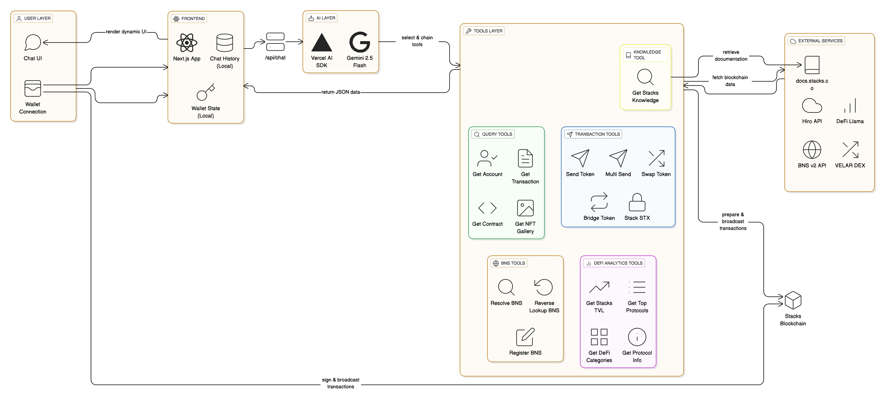

# 🚀 Blasko

> **Your AI-Powered DeFi Assistant for Stacks** - Talk to your blockchain as easily as texting a friend. No complex interfaces, just natural conversations.

## 🎥 Video Demo (Most Important!)

**Demo Link:** [Watch our 2-minute demo video here!](#)

*Experience how Blasko transforms DeFi complexity into simple conversations. See live token swaps, NFT galleries, and real-time analytics - all through natural language.*

---

## 🎯 The Problem

Blockchain adoption is stuck at 5% due to three critical barriers:

1. **Overwhelming Complexity** - 89% of users abandon DeFi because interfaces are too technical (42-character addresses, "gwei" calculations, "slippage tolerance")

2. **Fragmented Experience** - Users must juggle 5+ different platforms with different interfaces and logins for basic tasks

3. **Phishing Epidemic** - 400% increase in phishing attacks keeps users afraid of losing money to fake websites

*Our campus survey of 67 CS students validates this: 53.8% find it too complex, 46.2% fear security risks, yet 69.3% want an AI solution.*

---

## 💡 Our Solution

Blasko is the **first comprehensive AI assistant** built specifically for Stacks blockchain. Simply chat with Blasko to execute DeFi operations: *"Swap 10 STX for USDA"*, *"Show my NFTs"*, *"What's the TVL on Stacks?"* - and it's done. We've integrated 17 AI-powered tools covering token operations, DeFi analytics, NFT management, and blockchain knowledge - all through natural language.

---

## ✨ Key Features

### 💸 **Token Operations**
* Send STX or fungible tokens with natural language commands
* Multi-send for batch transfers (airdrops, payroll)
* Swap tokens across multiple DEXs (ALEX, Velar, Bitflow) with best price discovery
* Bridge assets between chains

### 📊 **Account & Data Management**
* Check balances and transaction history instantly
* View NFT collection in beautiful gallery
* Smart contract analysis and insights
* Wallet-aware context (AI knows YOUR address)

### 🏦 **Stacking & DeFi Analytics**
* Stack STX to earn Bitcoin rewards
* Real-time TVL charts and protocol rankings
* DeFi category breakdowns
* In-depth protocol information

### 🏷️ **BNS Integration**
* Resolve Bitcoin Name System addresses
* Register new BNS names
* Reverse lookup for any address

### 📚 **Knowledge Base**
* Ask "How do I stack STX?" and get answers from 50+ official documentation pages
* AI synthesizes information, not just links
* Covers stacking, sBTC, Clarity, BNS, and more

### 🎨 **Beautiful UX**
* Modern chat interface with smooth animations
* Chat history with search functionality
* Real-time streaming responses
* Dark mode optimized

---

## 🏗️ Architecture



**High-Level Flow:**
```
User Input → AI (Gemini 2.5 Flash) → Tool Selection → Blockchain APIs → 
Beautiful UI Components → User Confirmation → Transaction Execution
```

**Key Components:**
* **User Layer:** Chat UI with Next.js frontend + Wallet Connection (Leather/Hiro)
* **Frontend:** React components with local chat history storage
* **AI Layer:** Vercel AI SDK + Gemini 2.5 Flash for natural language processing
* **Tools Layer:** 17 specialized tools organized into:
  - 🔍 Query Tools (Get Account, Transaction, Contract, NFT Gallery)
  - 📤 Transaction Tools (Send Token, Multi Send, Swap Token, Bridge Token, Stack STX)
  - 🏷️ BNS Tools (Resolve, Reverse Lookup, Register)
  - 📊 DeFi Analytics Tools (Get Stacks TVL, Top Protocols, DeFi Categories, Protocol Info)
  - 📚 Knowledge Tool (Retrieve documentation from 50+ sources)
* **External Services:** Hiro API, docs.stacks.co, BNS v2 API, Velar DEX, DeFi Llama
* **Blockchain:** Direct interaction with Stacks blockchain for transaction preparation and broadcasting

---

## 🛠️ Tech Stack

**Frontend:** Next.js 15, React 19, TailwindCSS 4, Framer Motion, Radix UI

**AI:** Google Gemini 2.5 Flash, Vercel AI SDK, Zod validation

**Blockchain:** Stacks.js, ALEX SDK, Velar SDK, Bitflow SDK, BNS v2 SDK, Hiro API

**Utilities:** Cheerio, Recharts, React Syntax Highlighter

---

## 🚀 Getting Started

### **Prerequisites**
* Node.js 18+ installed
* A Stacks wallet (Leather or Hiro)

### **Installation**

1. **Clone the repository:**
   ```bash
   git clone https://github.com/banghoang/Blasko.git
   cd Blasko/blasko
   ```

2. **Install dependencies:**
   ```bash
   npm install
   ```

3. **Setup environment variables:**
   * Create a `.env.local` file in the `blasko` directory:
   ```bash
   HIRO_API_KEY=your_hiro_api_key_here
   GOOGLE_GENERATIVE_AI_API_KEY=your_gemini_api_key_here
   ```
   * Get Hiro API key: [https://www.hiro.so/](https://www.hiro.so/)
   * Get Gemini API key: [https://ai.google.dev/](https://ai.google.dev/)

4. **Run the development server:**
   ```bash
   npm run dev
   ```

5. **Open your browser:**
   * Navigate to [http://localhost:3000](http://localhost:3000)
   * Connect your Stacks wallet
   * Start chatting with Blasko! 🎉

---

## 🎯 Example Commands

Try these natural language commands:

```
"What's my STX balance?"
"Swap 10 STX for USDA"
"Show me my NFT collection"
"How can I stack STX?"
"What's the TVL on Stacks?"
"Send 5 STX to SP2J6ZY48GV1EZ5V2V5RB9MP66SW86PYKKNRV9EJ7"
"Register BNS name myname.btc"
```

---

## 🏆 What Makes Blasko Unique

| Feature | Competitors | Blasko |
|---------|-------------|--------|
| **Stacks-Native** | ❌ | ✅ |
| **Full DeFi Suite** | ⚠️ Partial | ✅ 17 Tools |
| **NFT Integration** | ❌ | ✅ |
| **BNS Support** | ❌ | ✅ |
| **Knowledge Base** | ❌ | ✅ 50+ Docs |
| **Multi-DEX** | ❌ Single | ✅ 3+ DEXs |
| **Open Source** | ❌ | ✅ |

**Blasko is the ONLY comprehensive AI DeFi assistant built for Stacks.**

---

## 📊 Market Validation

✅ **Problem Validated:** 67% of interested users avoid DeFi due to complexity  
✅ **Market Gap:** 8+ AI crypto assistants exist, NONE for Stacks  
✅ **Ecosystem Fit:** $200M+ TVL on Stacks, growing but underserved  
✅ **Technical Proof:** Fully functional prototype with real protocol integrations  

*See [PROBLEM_VALIDATION.md](PROBLEM_VALIDATION.md) for detailed research.*

---

## 🗺️ Roadmap

- ✅ **Now:** 17 AI tools, beautiful UI, real integrations
- 📅 **Q1 2025:** Community beta launch, user feedback
- 📅 **Q2 2025:** Mobile app, Developer API
- 📅 **Q3 2025:** Multi-language support, advanced AI features
- 📅 **2025+:** Multi-chain expansion, institutional features


---

## 👥 Team

* **Bang Hoang** - Full-stack Developer & Product Designer
  * [GitHub](https://github.com/banghoang) | [LinkedIn](#) | [Twitter](#)

---

## 🙏 Acknowledgments

* **Stacks Foundation** for building Bitcoin DeFi infrastructure
* **ALEX, Velar, Bitflow** for DEX integrations
* **Hiro** for excellent APIs and developer tools
* **Google** for Gemini AI capabilities

---

## 📄 License

MIT License - feel free to use and build upon Blasko!

---

## 💬 Contact & Support

* **Issues:** [GitHub Issues](https://github.com/banghoang/Blasko/issues)
* **Discussions:** [GitHub Discussions](https://github.com/banghoang/Blasko/discussions)
* **Twitter:** [@BlaskoAI](#)
* **Email:** hello@blasko.ai

---

<div align="center">

### 🌟 **Made with ❤️ for the Stacks Community** 🌟

**Star ⭐ this repo if you find Blasko useful!**

[Try Demo](#) • [Watch Video](#) • [Read Docs](blasko/KNOWLEDGE_FEATURE.md) • [Join Community](#)

</div>

